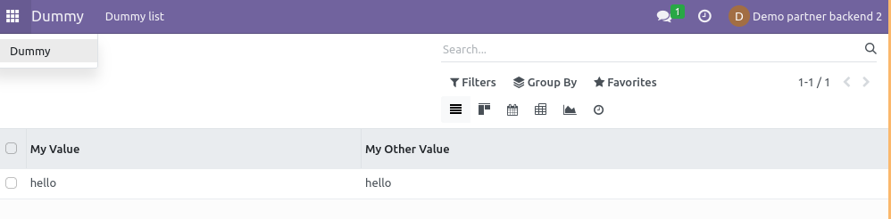

This module was written to extend the standard functionality regarding users
and groups management by adding a new `Backend user` group that only gives access
to odoo backend (`/web`):

* minimal default access:
  * users and partners (this is necessary to access your own data)
  * mail activity, notification and channel
  * presence
* minimal default menu
  * notification
  * activities
* minimal default access rules

The problem with the `Internal user` is when you want to gives access to the
backend to a really thin part of your business to some users, it's quite hard
to properly maintain those roles over the project life, a lot of models use
that group (`base.group_user`) by default which makes hard to maintains.

So that helps creating well-defined user groups with more controls.

This modules does 3 things:
* It hijack the has_group method of res.users by returning True for group_backend users when the requested group is group_user (The need for this needs to be investigated)
* It sets the res_users.share to False for group_backend users. This allows those users to access the backend.
* It sets the bare minimum permission in the ir.model.access.csv to display the backend

We suggest to use this module with its compagnon `base_user_role`

Here is an example where a backend ui user can only access and use the dummy app. No other application are available to this user. You may define your own application instead of the dummy one.

Limitations
~~~~~~~~~~~

At the time of writing, Odoo uses `res.users.share == False` to give the
backend access.
However to be able to access the backend without any errors some basic rights are necessary.
This module change the way `res.users.share` is computed to allow `group_backend users` to use the backend.

This avoids to write a lot of overwrite in different controllers from
different modules ('portal', 'web', 'base', 'website') with hard coded statements
that check if user is part of the `base.group_user` or `share == False` group.

.. warning::

    Using this module and grant a user with `group_backend`'s group is
    equivalent to grant `group_user`'s group everywhere `has_group`
    has been used.
