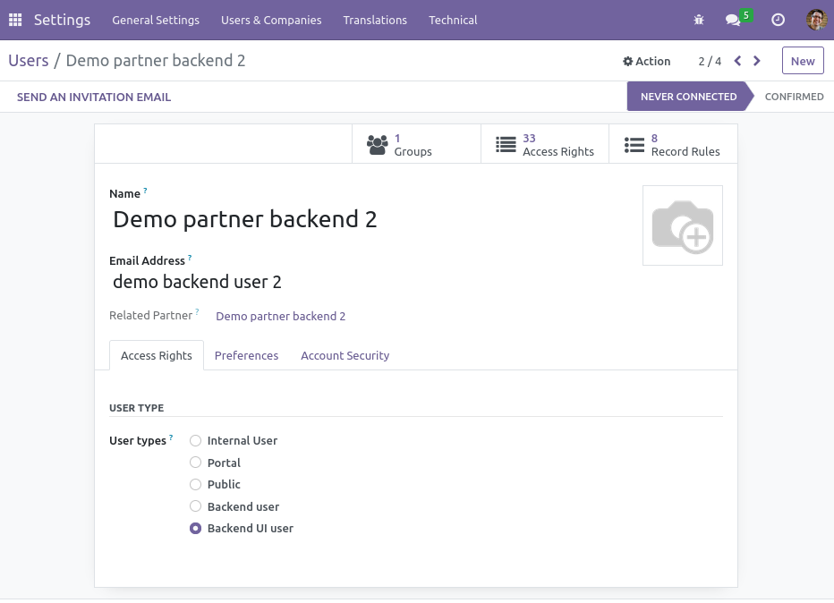

To use this module, you need to:

1.  Go to Configuration / Users / Users, choose a user and set the user
    type.

You get a users that is only able to access to the Odoo backend which
you can attach other groups that not implies other kind of users
(portal, internal users)

