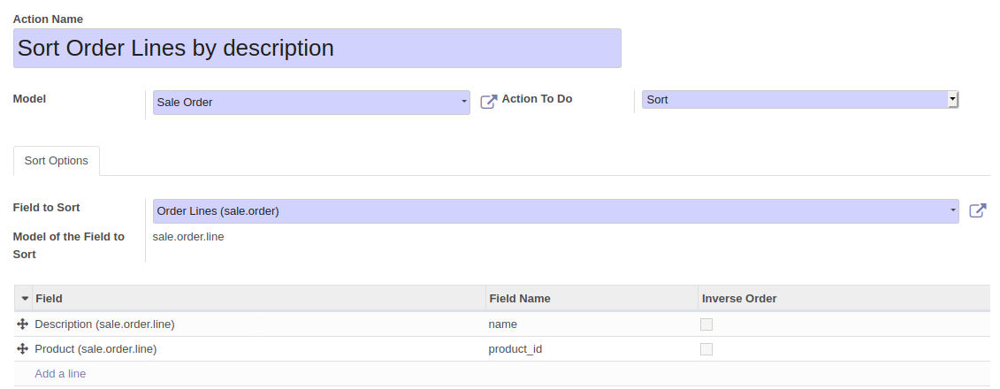

* Go to 'Setting / Technical / Actions / Server Actions'

* Create a new item

* Set a name that will be used for the Contextual Action

* choose a model

* Select 'Sort' option in the field 'Action To Do'

* Then, select a field to sort of this model. It should be a ``one2many`` field.

* Select then the criterias used to sort the selected field.

**Extra options**

* you can define groups whose members will have access to that option.
